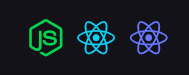

<h1 align="center">
  
</h1>

<h3 align="center">
  Gympoint
</h3>

# Projeto de certificação do bootcamp 9 da [Roketseat](http://rocketseat.com.br)

- Desafio Final Turma 9.0

## Organização

1. Backend em NodeJS [README](./backend/README.md)
2. Frontend em ReactJS [README](./frontend/README.md)
3. Mobile (Android) em React-Native [README](./mobile_android/README.md)

## FullStack Javascript

  

