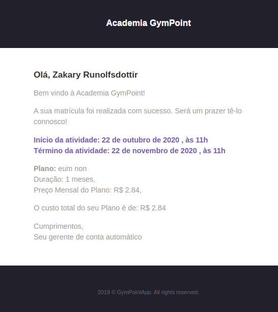
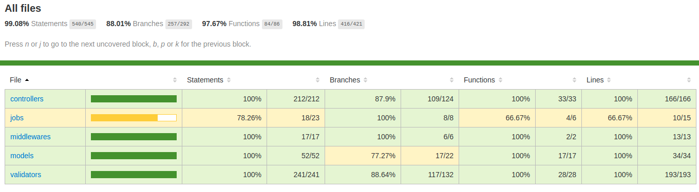

<h1 align="center">
  
</h1>

<h3 align="center">
  Gympoint
</h3>

# Backend em NodeJS para o desafio de certificação do Bootcamp GoStack da Roketseat (Gympoint)


## Aplicação: API do Gympoint

Gynpoint é um aplicativo de gerenciamento de uma academia, com as seguintes características:

1. Os Administradores devem ser autenticar;
2. Um administrador pode cadastrar alunos, planos, matrículas e responder a questões dos alunos.
3. Os administradores tem acesso ao sistema pela web.
4. Sempre que uma matrícula é realizada um e-mail é enviado ao aluno com uma mensagem de boas vindas.
5. Sempre que uma resposta for dada à pergunta de um aluno o mesmo recebe um e-mail com a pergunta e a resposta.
6. Os alunos, por meio do aplicativo _mobile_ podem realizar o _checkin_ e enviar perguntas aos administradores.
7. EXTRA: os administradores podem visualizar a quantidade de entradas dos alunos nos últimos 84 dias, bem como o gráfico dos horários mais utilizados. Uma lista com os aniversariantes dos próximos 30 dias pode ser obtida pelos administradores. Uma lista com alunos sem matrícula ativa também está disponível.

<p align="center">
  
</p>

<p align="center">
  
</p>

## Instalação e Inicialização

- os bancos de dados escolhidos foram o postgres e redis e as configurações deverão ser atualizadas no arquivo `.env`, no arquivo `.env.example` poderá ver um exemplo de configuração com os valores padrões.

```sh
cd backend
```

e

```sh
npm install
npm sequelize db:migrate
npm run dev
```

ou

```sh
yarn
yarn sequelize db:migrate
yarn dev
```

- para a execução de uma _queue_ que recebe jobs, no qual estão inclusos os de envio de emails:

```sh
npm run queue
```

ou

```sh
yarn queue
```

## Seeds

Caso pretenda popular o banco de dados com alguns exemplos poderá fazê-lo correndo o seguinte comando:

- de forma a simplificar os _seeds_ foram disponibilizados para serem usados em um banco de dados sem prévias inserções.
- pode usar o `yarn` ou o `npm`

```sh
yarn sequelize db:seed:all
```

para refazer, deverá realizar um rollback das seeds primeiro:

```sh
yarn sequelize db:seed:undo:all
```

- pode optar por rodar as _migrations_, as _seeds_ e iniciar o _nodemon_ com um único comando, este comando irá reiniciar os dados do banco de dados _postgres_ de acordo com os _seeds_.

```sh
yarn dev-seed
```

- pode optar por realizar as _migrations_ e popular apenas o usuário administrador padrão, com o comando:

```sh
yarn seed
```

## Rotas

Junto segue o arquivo ([Insominia_2020-01-03.json](./Insominia_2020-01-03.json)) para importar as rotas para o [Insomnia](https://insomnia.rest/)

| Método | Rota               | Privado |                                                                               |
| :----: | :----------------- | :-----: | ----------------------------------------------------------------------------- |
|  POST  | /sessions | NÃO | autenticação de usuário (administrador) |
|  GET   | /students/:student_id/checkins | NÃO | lista as entradas de determinado aluno |
|  POST  | /students/:student_id/checkins | NÃO | realiza a entrada de um aluno |
|  GET   | /students/:student_id/help-orders | NÃO | lista os pedido de ajuda criados por um aluno |
|  POST  | /students/:student_id/help-orders | NÃO | cria um pedido de ajuda para um aluno |
|  GET   | /dashboard/checkins/day | SIM | lista a quantidade de entradas por dia nos últimos 84 dias (por default), ou pelo período solicitado |
|  GET   | /dashboard/checkins/hour | SIM | lista a quantidade de entradas por hora nos últimos 84 dias (por default), ou pelo período solicitado |
|  GET   | /dashboard/checkins/birthdays | SIM | lista os aniversariantes (alunos) dos próximos 30 dias  (por default) |
|  GET   | /report/students/without/registration | SIM | lista de alunos que não possuam uma matrícula ativa |
|  GET   | /students | SIM | lista de alunos |
|  POST  | /students | SIM | cadastro de um aluno |
|  PUT   | /students/:id | SIM | atualização de um determinado aluno |
| DELETE | /students/:id | SIM | exclui um determinado aluno |
|  GET   | /plans | SIM | lista de planos |
|  POST  | /plans | SIM | cadastro de um plano |
|  PUT   | /plans/:id | SIM | atualização de um determinado plano |
| DELETE | /plans/:id | SIM | exclui um determinado plano |
|  GET   | /registrations | SIM | lista de matrículas |
|  POST  | /registrations | SIM | cadastro de uma matrícula |
|  PUT   | /registrations/:id | SIM | atualização de uma determinada matrícula |
| DELETE | /registrations/:id | SIM | exclui uma determinada matrícula |
|  GET   | /help-orders | SIM | lista de pedidos de auxílio |
|  POST  | /help-orders/:help_order_id/answer | SIM | cadastro a resposta a um determinado pedido de auxílio |

## Erros

A fim de manter a consistência nos _response errors_ todas as validações de requisição retornam um erro _status code_ 400 com a seguite estrutura JSON:

```json
{
  "error": "Validation fails",
  "messages": [
    {
      "name": "ValidationError",
      "path": "start_date",
      "type": "typeError",
      "errors": ["start_date must be a `date` type, but the final value was: `Invalid Date` (cast from the value `\"\"`)."],
      "inner": [],
      "message": "start_date must be a `date` type, but the final value was: `Invalid Date` (cast from the value `\"\"`).",
      "params": {
        "path": "start_date"
      }
    }
  ]
}
```

Para as validações das regras de negócio que não forem contempladas na requisição é lançado um erro que será capturado na saída da _response_, com a seguite estrutura JSON:

```json
{
  "error": "Validation fails",
      "messages": [
        {
          "errors": ["Student does not have a registration for today"],
        },
      ]
}
```

Esses erros e outros serão tratados e formatados pelo _Youch_ e será permitido a saída do erro conforme o ambiente seja de desenvolvimento ou de produção:

```js
this.server.use(async (err, req, res, next) => {
      if (process.env.NODE_ENV === 'development') {
        const erros = await new Youch(err, req).toJSON();

        return res.status(500).json(erros);
      }

      return res.status(500).json({ error: 'Internal server error' });
    });
```

## Teste

Os testes com o banco de dados ocorrem usando o _postgres_ por _default_. Caso queira usar o _sqlite_ deverá setar o **DB_DIALECT** no arquivo `.env.test` para _sqlite_, que por _default_ usa o banco de dados de nome gympointtest. (**o uso do _postgres_ para testes é recomendado, haja vista que alguns testes precisam realizar _querys_ não compatíveis com o SQL do _sqlite_**)

### Coverage

[tabela coverage](./__tests__/coverage/lcov-report/index.html) (`ctrl` ou `cmd` + click)

<p align="center">

</p>

## Segurança
*(updating)*
## Extra
*(updating)*

## Agradecimentos

Aos desenvolvedores e mantenedores das seguintes bibliotecas:

- [@sentry/node (BSD 3-Clause License)](https://github.com/getsentry/sentry-javascript);
- [bcryptjs (MIT)](https://github.com/dcodeIO/bcrypt.js);
- [bee-queue (MIT)](https://github.com/bee-queue/bee-queue);
- [cors (MIT)](https://github.com/expressjs/cors);
- [date-fns (MIT)](https://github.com/date-fns/date-fns);
- [dotenv (BSD 2-Clause)](https://github.com/motdotla/dotenv);
- [express (MIT)](https://github.com/expressjs/express);
- [express-async-errors (ISC)](https://github.com/davidbanham/express-async-errors);
- [express-brute (MIT)](https://github.com/AdamPflug/express-brute);
- [express-brute-redis (MIT)](https://github.com/AdamPflug/express-brute-redis);
- [express-handlebars (BSD 3-Clause)](https://github.com/ericf/express-handlebars);
- [express-rate-limit (MIT)](https://github.com/nfriedly/express-rate-limit);
- [fs (MIT)]();
- [helmet (MIT)](https://github.com/helmetjs/helmet);
- [jsonwebtoken (MIT)](https://github.com/auth0/node-jsonwebtoken);
- [mongoose (MIT)](https://github.com/Automattic/mongoose);
- [multer (MIT)](https://github.com/expressjs/multer);
- [node-cron (ISC)](https://github.com/node-cron/node-cron);
- [nodemailer (MIT)](https://github.com/nodemailer/nodemailer);
- [nodemailer-express-handlebars (MIT)](https://github.com/yads/nodemailer-express-handlebars);
- [pg (MIT)](https://github.com/brianc/node-postgres);
- [pg-hstore (MIT)](https://github.com/scarney81/pg-hstore);
- [rate-limit-redis (MIT)](https://github.com/wyattjoh/rate-limit-redis);
- [redis (MIT)](https://github.com/NodeRedis/node_redis);
- [sequelize (MIT)](https://github.com/sequelize/sequelize);
- [youch (MIT)](https://github.com/poppinss/youch): e
- [yup (MIT)](https://github.com/jquense/yup).

## License

MIT © mourabraz@hotmail.com
