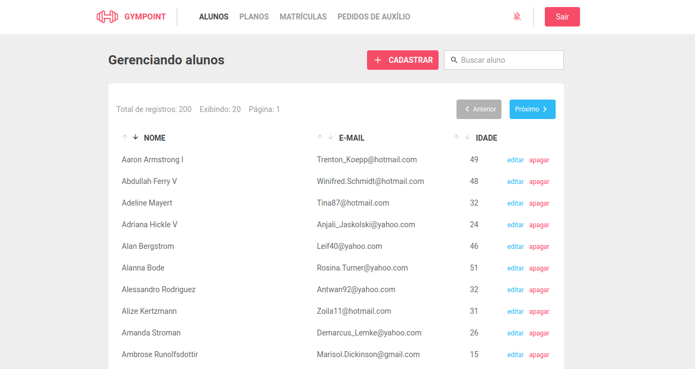

<h1 align="center">
  
</h1>

<h3 align="center">
  Gympoint
</h3>

# Frontend em ReactJS para o desafio de certificação do Bootcamp GoStack da [Roketseat](http://rocketseat.com.br)

## Aplicação: Frontend do Gympoint

O frontend utiliza a API do Gympoint ([pasta backend](../backend))

1. Esta aplicação será utilizada por Administradores da academia.

2. As páginas são:

- SigIn: para autenticação do usuário (apenas administradores);
- Dashboard: páginal inicial (com gráficos);
- Alunos: página que lista os Alunos da academia com paginação e ordenação pelo nome, email ou idade;
- Planos: página que lista os Planos da academia com paginação e ordenação pelo título, duração ou valor mensal;
- Matrículas: página que lista as Matrículas da academia com paginação e ordenação pelo nome do aluno, título do plano, data de início ou data de término;
- Pedidos de auxílio: _not implemented_;

- Cadastro de Alunos / Cadastro de Planos: Modal com animação com acesso pela página da lista respectiva;
- Edição de Aluno: modal que carrega um form para editar o aluno selecionado, por meio do `createPortal` do React;
- Visualização/Edição: Visualiza dados do aluno (apenas as entradas efetuadas nos últimos 84 dias) e possibilita a edição do cadastro.

<div align="center" style="margin: 25px 0">
  
  
  
  
  
  
  
  
  
  
</div>

- O cadastro de alunos foi implementado usando um modal, enquanto a edição de um aluno abre uma nova página. Esta página de edição recebe os dados do estudante pela rota, enquanto realiza uma busca à API para apresentar dados extras sobre o aluno. A opção de passar o aluno no state da rota teve como objetivo o treino.
- A fim de demonstrar o uso do _createPortal_ do React foi implementado um outro modo de edição, apartir da lista de alunos pode-se selectionar o aluno a editar e por meio de um formulário dentro do modal pode-se realizar a edição.

- Para efeitos de desenvolvimento o service/api.js adiciona um delay a todas as requisições:

```js
import axios from 'axios';

const api = axios.create({
  baseURL: 'http://localhost:3333',
});

/*
 * add delay for all requests, only for development purposes
 */
api.interceptors.request.use(
  config => new Promise(resolve => setTimeout(_ => resolve(config), 2000))
);

export default api;
```

## Instalação e Inicialização

```
cd frontend
```

e

```
npm install
```

ou

```
yarn
```

e

```
npm start
```

ou

```
yarn start
```

Acesse pelo Navegador:

[http://localhost:3000/](http://localhost:3000/)

## Agradecimentos

Aos desenvolvedores e mantenedores das seguintes bibliotecas:

- [@rocketseat/unform (MIT)](https://github.com/Rocketseat/unform);
- [axios (MIT)](https://github.com/axios/axios);
- [date-fns (MIT)](https://github.com/date-fns/date-fns);
- [date-fns-tz (MIT)](https://github.com/marnusw/date-fns-tz);
- [history (MIT)](https://github.com/ReactTraining/history);
- [immer (MIT)](https://github.com/immerjs/immer);
- [polished (MIT)](https://github.com/styled-components/polished);
- [prop-types (MIT)](https://github.com/facebook/prop-types);
- [react (MIT)](https://github.com/facebook/react);
- [react-datepicker (MIT)](https://github.com/Hacker0x01/react-datepicker);
- [react-dom (MIT)](https://github.com/facebook/react/tree/master/packages/react-dom);
- [react-icons (MIT)](https://github.com/react-icons/react-icons) **MaterialIcons (Apache License 2.0)**;
- [react-perfect-scrollbar (MIT)](https://github.com/goldenyz/react-perfect-scrollbar);
- [react-redux (MIT)](https://github.com/reduxjs/react-redux);
- [react-router-dom (MIT)](https://github.com/ReactTraining/react-router/tree/master/packages/react-router-dom);
- [react-scripts (MIT)](https://github.com/facebook/create-react-app/tree/master/packages/react-scripts);
- [react-toastify (MIT)](https://github.com/fkhadra/react-toastify);
- [reactotron-react-js (MIT)](https://github.com/infinitered/reactotron-react-js);
- [reactotron-redux (MIT)](https://github.com/infinitered/reactotron-redux);
- [reactotron-redux-saga (MIT)](https://github.com/infinitered/reactotron-redux-saga);
- [redux (MIT)](https://github.com/reduxjs/redux);
- [redux-persist (MIT)](https://github.com/rt2zz/redux-persist);
- [redux-saga (MIT)](https://github.com/redux-saga/redux-saga);
- [styled-components (MIT); ](https://github.com/styled-components/styled-components)e
- [yup (MIT)](https://github.com/jquense/yup).

## License

MIT © mourabraz@hotmail.com
